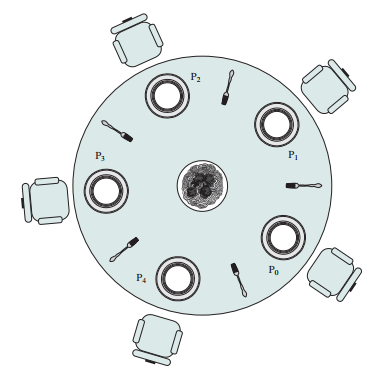

# philosophers

## subject
the philosopher life cycle is : eat - sleep - think - repeat.<br/> 
the simulation stops if a philosopher died of starving.. and obviousely they shouldn't die.
### mandatory part
philosophers are threads.<br/>
each philosopher has a fork in his right side but can't eat with only one fork,
so he takes the next philosopher's fork then put it back after he finish eating.<br/>
no one can use a fork which used by another philosopher, and no one knows if another
philosopher is dead.
### bonus part
philosophers are processes.<br/>
all forks are in the middle of the table.<br/>
the parent process knows if a philosopher is dead.<br/>
more infos at: [subject](https://cdn.intra.42.fr/pdf/pdf/57956/en.subject.pdf)
## compilation and execution
choose which part you want to run `cd philo` or `cd philo_bonus`.<br/>
compile it with command `make`.<br/>
execute it with the following arguments:
``````
./p [philosophers_number] [time_to_die] [time_to eat] [time_to_sleep] [number_of_times_each_philosopher_must_eat].
``````
(the last argument is optional).
## simulation
this program runs an infinity loop declaring the state of each philosopher in the current time.<br/>
the output loks like:<br/>
`[timestamp_in_ms] [philosopher's name] [state]`.
